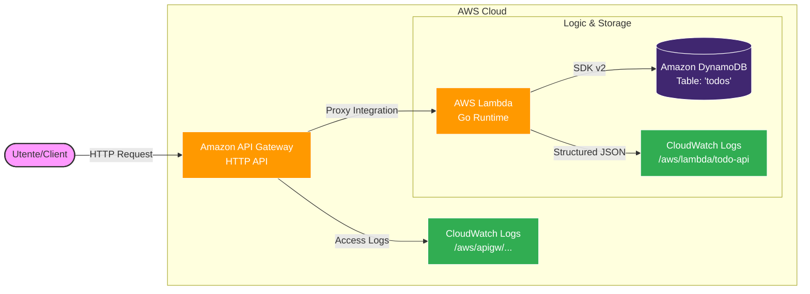

# Serverless ToDo API — AWS Lambda, API Gateway, DynamoDB, CloudWatch

A small but production‑style **serverless REST API** for managing ToDo items, built in **Go** on AWS.  
The API exposes CRUD endpoints over HTTP, runs on **AWS Lambda**, persists data in **DynamoDB**, and is fronted by an **API Gateway HTTP API**. Logging and monitoring are handled via **CloudWatch Logs** for both Lambda and API Gateway.

---

## 1. High‑Level Architecture

**Goal:** Learn how to design and implement a serverless backend using multiple AWS managed services, with minimal operational overhead and near‑zero idle cost.

### Components

- **Amazon API Gateway – HTTP API**
  - Acts as the public HTTP entry point for the REST API (`/health`, `/todos`, `/todos/{id}`).
  - Handles request routing, validation of HTTP methods, and integrates with Lambda via **Lambda proxy integration**.
  - Access logging is enabled to **CloudWatch Logs** for observability.

- **AWS Lambda (Go)**
  - Single Lambda function (`todo-api`) implemented in Go.
  - Uses `events.APIGatewayV2HTTPRequest` / `APIGatewayV2HTTPResponse` for HTTP API integration.
  - Contains routing logic for:
    - `GET /health`
    - `GET /todos`
    - `POST /todos`
    - `GET /todos/{id}`
    - `PUT /todos`
    - `DELETE /todos/{id}`
  - Uses a shared **DynamoDB client** and `DynamoStore` to interact with the data layer.
  - Emits structured JSON logs to CloudWatch (level, message, method, path, requestId, error).

- **Amazon DynamoDB**
  - Single table `todos` used with a **single‑table design**.
  - Primary key:
    - Partition key: `pk` (String)
    - Sort key: `sk` (String)
  - ToDo items are stored as:
    - `pk = "USER#<userId>"` (for this lab: `USER#demo`)
    - `sk = "TODO#<todoId>"`
  - Attributes include: `id`, `title`, `description`, `status`, `createdAt`, `updatedAt`.
  - DynamoDB is configured in **on‑demand capacity mode** to avoid capacity planning and stay within Free Tier for low traffic.

- **AWS Identity and Access Management (IAM)**
  - Dedicated **Lambda execution role** (`todo-lambda-role`):
    - Attached managed policy `AWSLambdaBasicExecutionRole` for CloudWatch logging.
    - Custom inline/managed policy granting **least‑privilege CRUD** on the `todos` table:
      - `dynamodb:GetItem`, `PutItem`, `UpdateItem`, `DeleteItem`, `Query` on `arn:aws:dynamodb:<region>:<account-id>:table/todos`.

- **Amazon CloudWatch Logs**
  - Log group `/aws/lambda/todo-api`:
    - Lambda automatically sends execution logs (`START`, `END`, `REPORT`) plus structured JSON logs from the application.
  - Log group `/aws/apigw/serverless-todo-api`:
    - API Gateway HTTP API access logs in JSON format (requestId, httpMethod, path, status, integrationStatus, etc.).

### Architecture diagram:



---

## 2. Data Model & DynamoDB Design

The project uses a simple but realistic **single‑table design** for DynamoDB [web:120][web:122][web:133].

### Table: `todos`

- **Primary key**
  - `pk` (Partition key, String)
  - `sk` (Sort key, String)
- **Item structure for a ToDo**

Example item:

```json
{
  "pk": "USER#demo",
  "sk": "TODO#12345",
  "id": "12345",
  "title": "Write Lambda in Go",
  "description": "Implement serverless ToDo API",
  "status": "IN_PROGRESS",
  "createdAt": "2026-03-04T10:00:00Z",
  "updatedAt": "2026-03-04T11:05:00Z"
}
```
